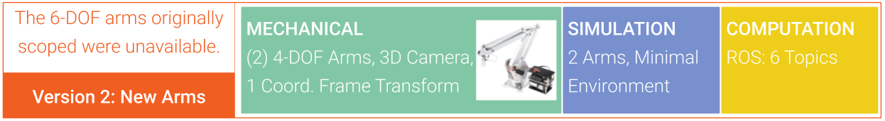
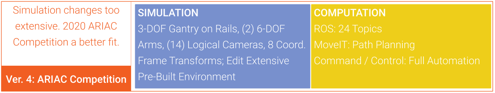
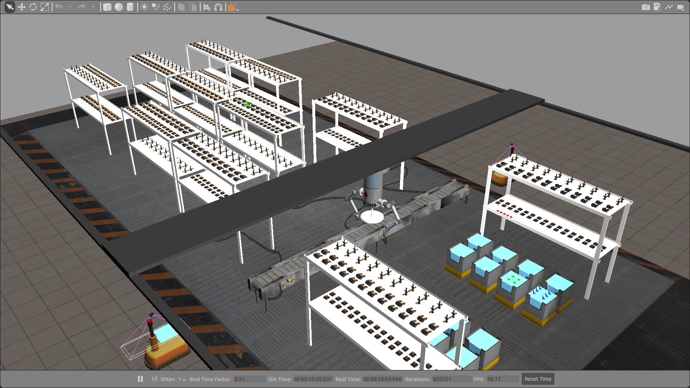
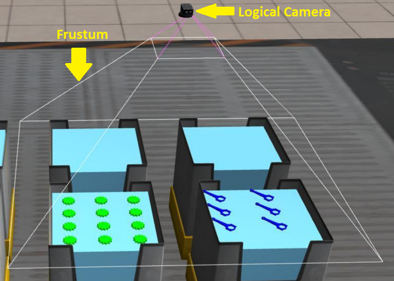
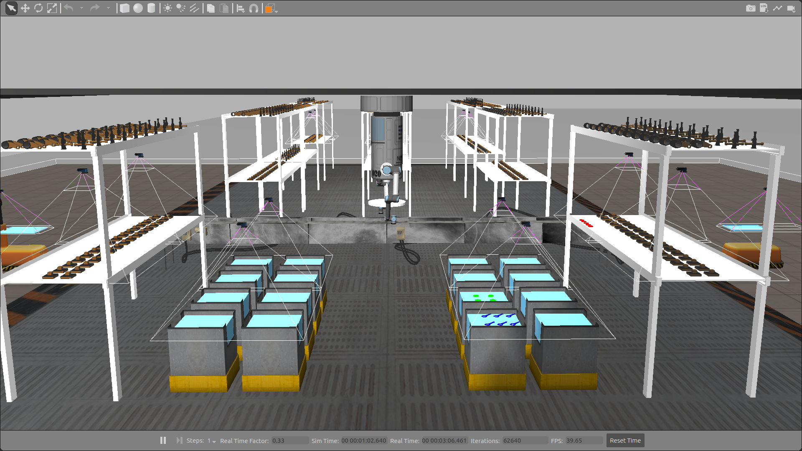
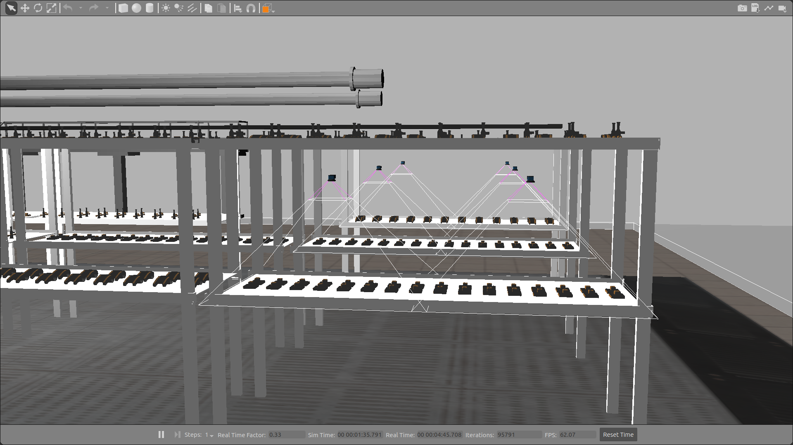

# Auto Order Fulfillment
Contents
* [Original Proposal](#original-proposal)
* [Challenges and Adjustments](#challenges-adjustments)
	* [Version 2: New Arms](#version-2-new-arms)
	* [Version 3: All Simulation](#version-3-all-simulation)
	* [Version 4: ARIAC Competition Environment](#version-4-ariac)
* [Final Project Design](#final-project-design)
	* [Base Simulation with no Sensors](#base-simulation-no-sensors)
	* [My Design](#my-design)
* [Software Setup](#software-setup)
* [Results](#results)
	* [Running Simulation Scenario A](#results-running-simulation-a)
	* [Running Simulation Scenario B](#results-running-simulation-b)
	* [Running Simulation Scenario C](#results-running-simulation-c)
* [Learned Along the Way](#learned)

---
<a name="original-proposal"/>

## Original Proposal
To design a collaborative, multi-robot system incorporating computer vision, robot operating system (ROS), and multi-robot control to demonstrate skills needed to pursue a career as a robotics software engineer.  
[See proposal PDF](media/OriginalProposal.pdf)

The original proposal included mechanical, simulation, and computation components.
* Mechanical:
	*  (2) 6-DOF Arms (sized for desktop use and under $2K total for 2)
	* 3D Camera
* Simulation:
	* Minimal Gazebo environment with the 2 arms
* Computation: 
	*  (6) ROS Topics

<a name="challenges-adjustments"/>

## Challenges and Adjustments

<a name="version-2-new-arms"/>

### Version 2: New Arms

The 6-DOF arms originally proposed were a new product designed and built in China. They were in their first production runs as a new product and quickly went on back-order. With no chance of getting the arms during the semester, the decision was made in late February to find replacement arms. 

I searched for a couple weeks for replacement arms that met the project requirements in terms of size, range of motion, and digital assets (for simulation). I eventually settled on the uArm 4-DOF desktop arms. They met all requirements and were immediately available, though they did have less range of motion. 

**Version 2 Change:** (2) 6-DOF Arms --> (2) 4-DOF Arms

<a name="version-3-all-simulation"/>

### Version 3: All Simulation

Halfway into the semester the campus closed because of COVID-19. This prevented any work with physical hardware and forced the entire project to move to a simulation only environment. I found a pre-built simulation environment that had two 6-DOF arms. The plan is to edit this pre-built environment to make it closely match the original goal of the project, including adding a camera and various bins for product sorting.   

**Version 3 Changes** 
 * Mechanical arms + 3D camera --> Gazebo simulation only 
 * Minimal Gazebo environment --> Complex Gazebo environment
 * 6 ROS Topics (for arms and grippers) --> 10 ROS Topics (arms, grippers, cameras)  

<a name="version-4-ariac"/>

### Version 4: ARIAC Competition Environment

Editing the pre-built environment proved to be a massive undertaking. Just editing it to include the components I needed would have taken the rest of the semester with no time left to actually code the simulation to function as intended: to autonomously identify and sort products.  

In searching for pre-built cameras and alternative arms to add to the environment, I found the ARIAC 2020 Competition Gazebo simulation environment. It included all of the components and associated ROS services and topics to drive them, including multiple types of camera sensors, product shelves, product bins, parts that can be programmatically created and placed throughout the environment, and an in-built "product order" system to generate orders to be fulfilled by the dual-arm robot moving throughout the environment. 

**Version 4 Changes:** See [Final Project Design](#final-project-design)

<a name="final-project-design"/>

## Final Project Design

[ARIAC Competition website](https://www.nist.gov/el/intelligent-systems-division-73500/agile-robotics-industrial-automation-competition)

The pre-built ARIAC 2020 Competition simulation environment provided by the NIST includes the following components:

* Gazebo:
	* Factory floor "world" environment
	* 3-DOF ceiling-mounted gantry on rails
	* (2) 6-DOF robot arms attached to either side of the gantry each with pneumatic grippers
	* Assets for 6 different sensors: break beam, laser scanner, depth camera, logical camera, proximity sensor, RGB-D camera
	* (2) wheeled order-fulfillment carts with QA and order-verification sensors
	* Conveyor belt
	* (11) 2-tier shelves
	* (16) parts bins
	* Dummy parts
	* Real parts for order fulfillment: 2 types, 3 colors each
* ROS:
	* Services and topics supporting all of the Gazebo assets
	* "Product Order" service and topic to publish information about the products needed for each order
	* Optional MoveIT integration
	* Launch files to start the simulation in both testing and competition modes 

My tasks in this new environment:
* Select desired sensors from those provided
* Place the selected sensors throughout the environment
* Read the "product order" topic to determine which parts are needed
* Read the sensors to determine where the needed parts are located in the environment 
* Transform the frame coordinates of each needed part from the camera frame to the world frame pose and robot-arm orientation so it can be picked up by one of the robot arms
* Add way-points and poses to prevent arms and robot from running into any obstacles
* Use MoveIT and way-points to plan a path for the robot and arm to reach the part, pick it up, and deliver it to the order fulfillment bin

Constraints of simulation:
* Parts will be spawned automatically in any of:
	* Middle shelf of 5 of 11 shelving units (3 rear shelves and 2 front shelves)
	* Any of the 16 parts bins
	* On the conveyor belt (optional)
* Sensors can be placed in open space (they do not need to be attached to a supporting structure)
* [Scenario A](#results-running-simulation-a):
	* Parts will be spawned only on shelves and bins
	* 2 Orders with 3 parts each need to be fulfilled
	* No unusual challenges
* [Scenario B](#results-running-simulation-b):
	* Parts will be spawned only on shelves and bins
	* 2 Orders with 3 parts each need to be fulfilled
	* Pneumatic gripper will periodically fail, dropping a part - part must be picked again from another location
* [Scenario C](#results-running-simulation-c):
	* Scenario B + parts will periodically spawn on conveyor belt

<a name="base-simulation-no-sensors"/> 

#### Base Simulation with no Sensors

This is the Gazebo environment provided by the ARIAC 2020 Competition. It contains all of the shelves, bins, the gantry robot, some "dummy" parts, and the "real" parts to be picked to fulfill orders.  
The "real" parts are in red, green, and blue.  
The initial environment lacks any sensors to determine where the parts have been spawned.

<a name="my-design"/> 

#### My Design

Here I have added 14 logical cameras to the Gazebo environment provided by the ARIAC 2020 Competition.The logical cameras are able to identify the "real" parts in their view by part type and color.  
Each logical cameras each has its own reference frame separate from the world frame. The parts detected have their pose and orientation determined with respect to the detecting camera's frame. Thus each part's frame must be transformed with respect to both the world frame and the frame of the end effector that will be used to pick it up.

* 14 logical cameras:
	* 2 each per shelf where parts may spawn
	* 1 for every group of 4 parts bins where parts may spawn

[YAML file placing sensors in environment](code/sensors.yaml)   

<a name="software-setup"/>

## Software Setup
Entire environment running in a virtual machine (VM):
* Host: 
	* Windows 10 Home
	* Intel Core i7-6700HQ CPU
	* 16GB RAM
	* NVIDIA GeFOrce GTX 960M GPU
	* VMware Workstation 15 Pro
* Guest:
	* Ubuntu 18.04
	* Single processor, 4 cores allocated
	* 8GB RAM
	* Gazebo 9
	* ROS 1 Melodic
	* MoveIT 

Code Created (in [code folder](code)):
* [YAML file placing sensors in environment](code/sensors.yaml)
* [MoveIT python file to run simulation](code/simulation.py)
	* Reads sensors to locate all products
	* Reads "product order" topic
	* Transforms product frame
	* Calls path planning algorithm
	* Picks parts and delivers them to correct order-fulfillment cart

<a name="results"/>

## Results

<a name="results-running-simulation-a"/>

### Running Simulation Scenario A: 2 Orders, No Challenges

Here I have added the code to determine where parts have been spawned by reading all of the logical cameras in the scene. 
Each detected part's frame is transformed to the world frame and the end effector frame.  
The automated set of orders is read (as a ROS topic; again, provided by the ARIAC competition environment) to determine which parts are needed for each order.  
The location of the next part on the order is parsed to determine how to get the robot to it, and MoveIT is used to calculate the path to the part.  
The robot picks each part and delivers it to the robotic tray assigned to that order.   

<a name="results-running-simulation-b"/>

### Running Simulation Scenario B: 2 Orders, Products Dropped Randomly

***In Progress***  
discussion of code design and plan  
image and link to video  

<a name="results-running-simulation-c"/>

### Running Simulation Scenario C: Scenario B + Parts on Conveyor Belt

***In Progress***  
discussion of code design and plan  
image and link to video  

<a name="learned"/>

## Learned Along the Way

edX “Hello ROS” course:
-   6 weeks, ~80 hrs    
-   ROS, Gazebo, MoveIT, rViz

Research for New Arms:
-   Cost vs. Capabilities
-   Simulation Assets

Investigate Pre-Built Gazebo Environments & Attempt to Modify

Outdated 4-DOF Arm Simulation Asset:
-   Fork Outdated Code
-   Manually Update from Gazebo 7 to Gazebo 9
-   Publish Updated Code

Update Ideal New Simulation Environment:
-   Remap Arm Joints
-   Add Logical Cameras
-   Design Control Algorithm
